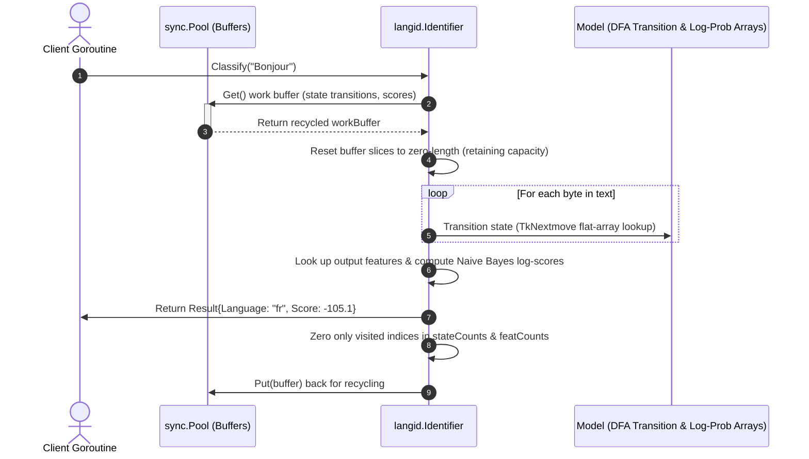

# Architecture and Background

`langid-go` is a pure Go port of the Naive Bayes language identification algorithm. This document provides historical context, design motivation, and a deep dive into the high-performance, zero-allocation architecture.

---

## 1. Port Lineage and Scope

The library is designed to bring a reliable, lightweight, and high-performance language classifier to the Go NLP ecosystem:

- **Initial Lineage**: Ports the runtime classifier and model execution paths of [langid.c](https://github.com/saffsd/langid.c), utilizing its flat-array DFA state transition system.
- **Parity Reference**: Aligns API behavior, ranking, normalization, and subsetting mechanics with the reference implementations in [langid.py](https://github.com/saffsd/langid.py) and [langid.js](https://github.com/saffsd/langid.js).
- **Out of Scope**: Reimplementing the complex multi-stage statistical model training pipeline in Go. New models are trained with Python tools and converted using `scripts/convert_model.py`.

---

## 2. Background and Motivation

In high-throughput Go production systems (such as LLM gateways, chat routing, and stream-processing pipelines), developers previously had to choose between several compromised options:

### The Fall of `lingua-go`
[`lingua-go`](https://github.com/pemistahl/lingua-go) was once marketed as the most accurate native language detector for Go, particularly on short text. However, it suffers from severe operational issues:
- **Project Abandonment**: The Go port has been abandoned for years (while its Rust counterpart [`lingua-rs`](https://github.com/pemistahl/lingua-rs) continues to be actively maintained, leaving the Go project stuck in a perpetual state of transition, see [lingua-go#68](https://github.com/pemistahl/lingua-go/issues/68)).
- **Short & Mixed Text Fragility**: In practice, it frequently fails on short sentences containing mixed scripts, multilingual vocabularies, or modern brand/product names, often throwing incorrect, entirely random language predictions (see [lingua-go#82](https://github.com/pemistahl/lingua-go/issues/82)).
- **Severe Repository Bloat**: The module is incredibly heavy because it is bloated with unnecessary test data files rather than maintaining just the necessary runtime models or active clean training pipelines (see [lingua-go#78](https://github.com/pemistahl/lingua-go/issues/78)).
- **Resource Overhead**: It introduces prohibitive computational and memory allocations on high-throughput pipelines.

### The Abandonment of `whatlanggo`
While extremely fast, [`whatlanggo`](https://github.com/abadojack/whatlanggo) was abandoned over 7 years ago (outstanding pull requests like [whatlanggo#22](https://github.com/abadojack/whatlanggo/pull/22) and [whatlanggo#27](https://github.com/abadojack/whatlanggo/pull/27) remain unmerged, despite its Rust predecessor [`whatlang-rs`](https://github.com/greyblake/whatlang-rs) remaining active). It exhibits severe limitations:
- **Short Text Failures**: Struggles with short or single-word inputs, often failing to detect languages or misidentifying them completely (see [whatlanggo#21](https://github.com/abadojack/whatlanggo/issues/21)).
- **Incompatible Format**: It returns results exclusively in three-letter ISO 639-3 codes, requiring custom mapping wrappers to integrate with pipelines utilizing standard ISO 639-1 two-letter codes.
- **Limited Language Support**: It supports a restricted set of languages compared to modern NLP needs.

### Fragility of CGO Wrappers
Wrapping the C implementation of `langid.c` (e.g. `dbalan/langid_go`) via CGO introduces significant friction:
- Complicates cross-compilation.
- Imposes severe thread overhead during C/Go boundary transitions on high-concurrency loops.
- Bypasses standard Go tooling and can interfere with the Go GC.

`langid-go` resolves these trade-offs by providing a **100% pure Go implementation** that achieves mathematical parity with `langid.py` and runs with **zero allocations** in concurrent hot loops.

---

## 3. High-Performance Zero-Allocation Architecture

Standard Naive Bayes classifiers require dynamic memory allocation during text processing to keep track of state transitions, feature occurrences, and probability confidence scores.

To eliminate GC pauses and run-time allocation overhead, `langid-go` utilizes a flat-array DFA state machine combined with a recycled memory layout managed via `sync.Pool`.

### The Recycling Hot Loop

1. **`sync.Pool` of Work Buffers**: The identifier initializes a pool of `*workBuffer` structures. Each buffer pre-allocates slices matching the model's states and features.
2. **Dynamic Traversal with Zero Allocation**: When text is passed for classification, a buffer is retrieved from the pool.
3. **Sparse Set Resets**: Rather than zeroing entire large arrays (which is slow), `langid-go` tracks precisely which states and features were visited (`activeStates` and `activeFeats`). It only zeroes those active indices before returning the buffer to the pool.

### Architecture Flow



### Buffer Struct Layout
```go
type workBuffer struct {
	stateCounts  []uint32   // Counts of visited states (len = NumStates)
	activeStates []uint16   // Dynamic list of visited state indices
	featCounts   []uint32   // Counts of triggered features (len = NumFeats)
	activeFeats  []uint32   // Dynamic list of triggered feature indices
	scores       []float64  // Recycled slice for output probability scores
}
```

By retaining slice capacities and avoiding reallocation, `langid-go` achieves outstanding memory efficiency under heavy concurrency.
