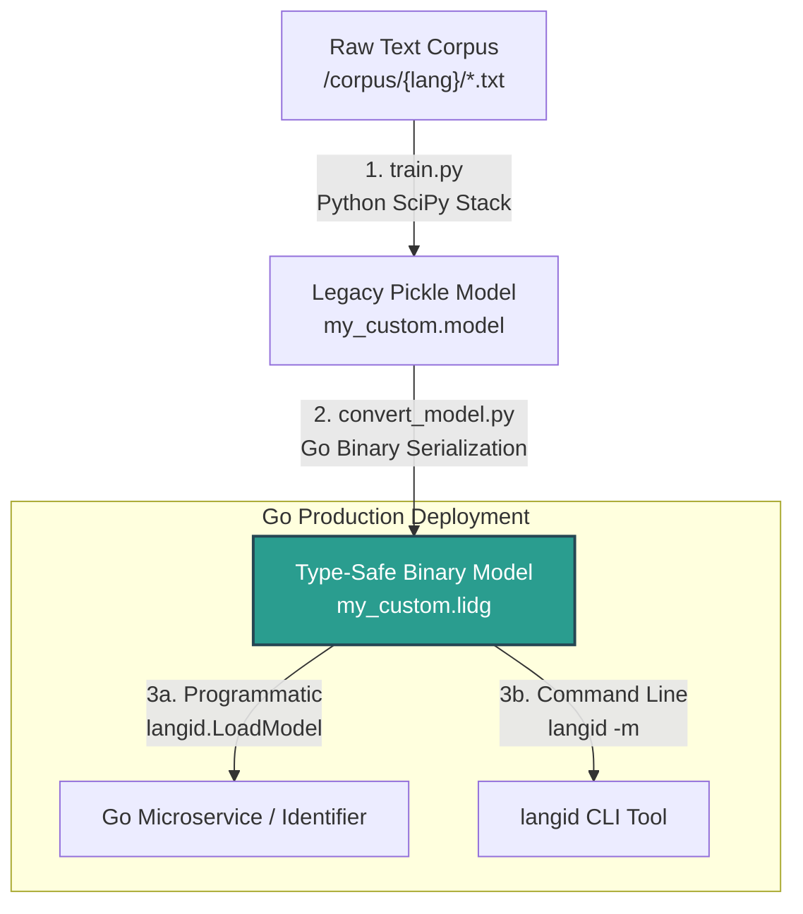

# Model Training and Customization

`langid-go` is built to serve as a highly concurrent, zero-allocation inference engine. It executes pre-compiled model structures but delegates model training and raw compilation tasks to Python. 

This document explains the technical reasons behind this architectural decision and walks you through the step-by-step workflow of training, converting, and executing custom language models.

---

## 1. Architectural Decisions and Scope

To keep the Go runtime lightweight, secure, and free from external dependencies or floating-point precision drift, the following decisions were made:

### Go-Native Training remains a planned roadmap item
Model training is a multi-stage statistical operation requiring corpus directory scanning, byte-level sliding window tokenization, Shannon information-gain calculations, n-gram optimization, and Aho-Corasick DFA state-machine generation. These tasks currently rely heavily on the Python scientific stack (`numpy` and `scipy`). Native Go training remains planned on the [roadmap](./TODO.md) as suitable native libraries are identified.

### Direct Legacy Python Model Loading is Out of Scope
The original models generated by `langid.py` are base64-encoded, `bz2`-compressed Python 2 `pickle` files. Parsing Python pickles in Go is highly insecure (vulnerable to arbitrary code execution), slow, and fragile due to language version mismatch.

Instead, custom models are compiled using the reference Python pipeline and converted into highly optimized, type-safe Go `.lidg` binary files.

---

## 2. Model Compilation Pipeline

The diagram below outlines the path a model takes from a raw training corpus to production inference in Go:



---

## 3. Custom Model Workflow Step-by-Step

### Step 1: Train Your Model in Python
Use the official Python training toolkit available in the original `langid.py` repository: [langid.py/langid/train](https://github.com/saffsd/langid.py/tree/master/langid/train).

Organize your training corpus in directories where each subdirectory is named after its ISO language code:
```text
/corpus
  ├── en/
  │    ├── doc1.txt
  │    └── doc2.txt
  └── es/
       ├── doc1.txt
       └── doc2.txt
```

Run the training pipeline:
```bash
python3 path/to/langid.py/langid/train/train.py -m /path/to/output_dir /path/to/corpus
```
This process generates a legacy model file (e.g., `my_custom.model`).

### Step 2: Convert Model to Go `.lidg` Format
Convert the legacy model into the optimized `.lidg` binary file using the conversion utility provided in the `langid-go` repository:

```bash
python3 scripts/convert_model.py my_custom.model model/my_custom.lidg
```

*(This utility deserializes the Python data arrays, verifies structural integrity, and packs the DFA state transitions, language maps, and probability tables into a flat, type-safe binary structure).*

### Step 3: Run Your Custom Model in Go

#### A. Programmatically
Load and run the model within your application using the package-level `LoadModel` function:

```go
package main

import (
	"fmt"
	"log"

	"github.com/ilpy20/langid-go"
)

func main() {
	// Load the custom model
	id, err := langid.LoadModel("model/my_custom.lidg")
	if err != nil {
		log.Fatalf("failed to load custom model: %v", err)
	}

	// Classify a string using the custom classifier instance
	res, err := id.IdentifyString("This is classified using our custom model.")
	if err != nil {
		log.Fatalf("failed to classify: %v", err)
	}

	fmt.Printf("Language: %s (Log Score: %.2f)\n", res.Language, res.Score)
}
```

#### B. Via the CLI
Instruct the CLI executable to use your custom model by passing its path via the `-m` or `--model` flag:

```bash
./langid -m model/my_custom.lidg <<< "This text will be classified by your custom model"
```
